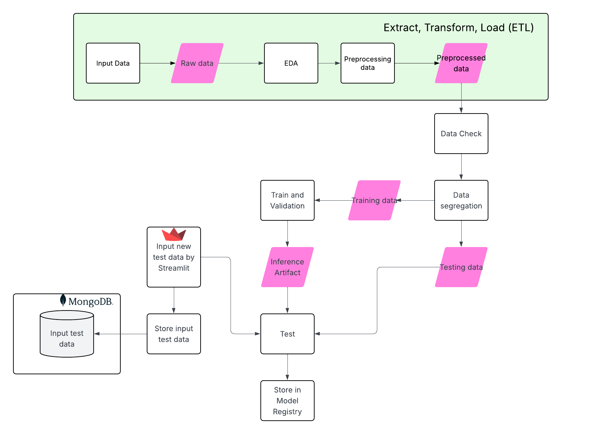

# 📦 MLOps Project K64 – Bank Term Deposit Prediction

Welcome to the **MLOps Project K64** repository! This project implements a full MLOps pipeline to predict whether a bank client will subscribe to a term deposit, using the **Bank Marketing Dataset**.

---

## 📌 Project Overview

This project applies MLOps principles to the entire machine learning lifecycle, including:

- Data ingestion and preprocessing
- EDA (Exploratory Data Analysis)
- Model training, validation, and testing
- Model registry
- Streamlit interface for prediction
- MongoDB integration for test data storage

---

## ⚙️ Technologies Used

- **Python 3.10**
- **scikit-learn**
- **pandas**, **numpy**, **matplotlib**, **seaborn**
- **MLflow** – for model tracking and registry
- **Streamlit** – for interactive user input and inference
- **MongoDB** – for storing new test input data
- **n8n** – optional future automation (e.g., retraining trigger)

---

## 📚 Dataset Information

This project uses the **Bank Marketing Dataset** with social and economic features, made publicly available for research purposes.

> **Citation Request**  
> If you use this dataset, please cite:  
> **[Moro et al., 2014]** S. Moro, P. Cortez, and P. Rita.  
> *A Data-Driven Approach to Predict the Success of Bank Telemarketing*.  
> Decision Support Systems. [DOI: 10.1016/j.dss.2014.03.001](http://dx.doi.org/10.1016/j.dss.2014.03.001)  
> - [PDF](http://dx.doi.org/10.1016/j.dss.2014.03.001)  
> - [BibTeX](http://www3.dsi.uminho.pt/pcortez/bib/2014-dss.txt)

### 🔍 Source

- Created by: Sérgio Moro, Paulo Cortez, and Paulo Rita (2014)  
- Original UCI Repository: [Bank Marketing Dataset](http://archive.ics.uci.edu/ml/datasets/Bank+Marketing)

### 📌 Dataset Variants

- `bank-additional-full.csv`: Full dataset (41,188 instances)
- `bank-additional.csv`: 10% subset (4,119 instances), suitable for computationally intensive models

### 🧠 Prediction Task

- **Goal**: Predict if a customer will subscribe to a term deposit (target: `y`, values: `yes` or `no`)

---

For full attribute definitions, see the paper:  
**[Moro et al., 2014]** *A Data-Driven Approach to Predict the Success of Bank Telemarketing*

## 📁 Folder Structure

1. api
   - app.py
   - main.py
   - pipeline.py
   - query_live_api.py
   - test_main.py
2. bankmkt
3. notebook
   - notebooks
   - data
   - wandb
   - artifact
4. environment.yml

## 📑 Model Card

The model was deployed to the web using the FastAPI package and API tests were created. The API tests will be embedded in a CI/CD framework using GitHub Actions. After we built our API locally and tested it, we deployed it to Render and tested it again live. Weights and Biases were used to manage and track all artifacts.  


The project notebooks are organized into the following 7 parts:

1. Data Search
2. Exploratory Data Analysis (EDA)
3. Data Preprocessing
4. Model Testing
5. Data Splitting (Training & Testing)
6. Model Training
7. Model Evaluation

---

## 🚀 How to Run the Project

1. **Clone the Repository**
   ```bash
   git clone https://github.com/Qchi1610/Mlops_Project_K64.git
   cd Mlops_Project_K64
2. **Create a Virtual Environment**
   ```bash
   conda env create -f environment.yml
3. Activate the Virtual Environment
   ```bash
     # For Linux/macOS
   source bankmkt/bin/activate

   # For Windows (Command Line)
   bankmkt\Scripts\activate

   # For Windows (PowerShell)
   bankmkt\Scripts\Activate.ps1

## Practice notebooks
To understand the procedures of design code on local, including important procedures like: fetching data, visualization, preprocessing, checking data, segregating data, training, and testing, you should run step-by-step all notebooks on the /notebook directory. Note that, you should select a right kernel is .venv to avoid libraries conflict by


You should register Weight and Bias to storage all artifacts, metrics, and models. You can register your account on wandb. After that, you should create a virtual environment file is notebooks/.env
## Weight and Biases Model Registry
Weight and Biases is used to register model training runs. Artifacts, which includes models, plots and statistics, are stored in a Weight and Biases, while the server is run in a Render, local Docker container and accessible via the url specified above.

After each model training, tuning and cross-validation run, the 5 best models are logged with their corresponding accuracy, AUC, recall and specificity on both the validation and test sets. To speed things up, currently also only 5 different parameter combinations are evaluated, but this can easily be adjusted.
