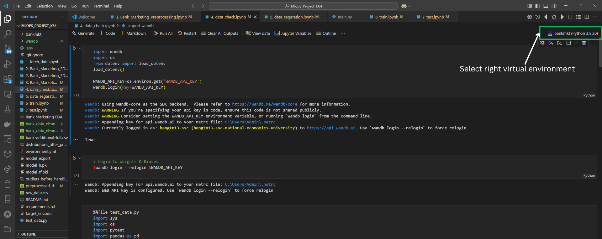
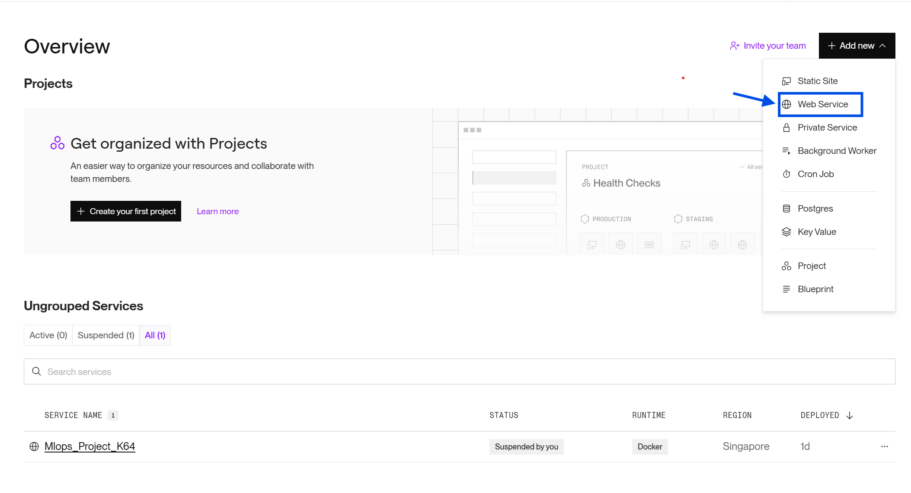
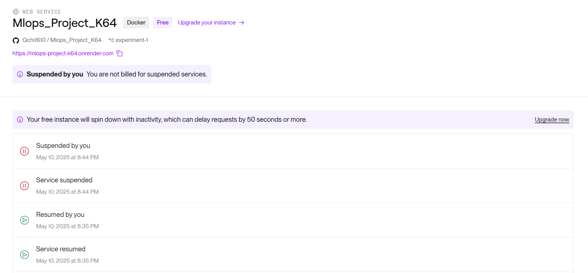
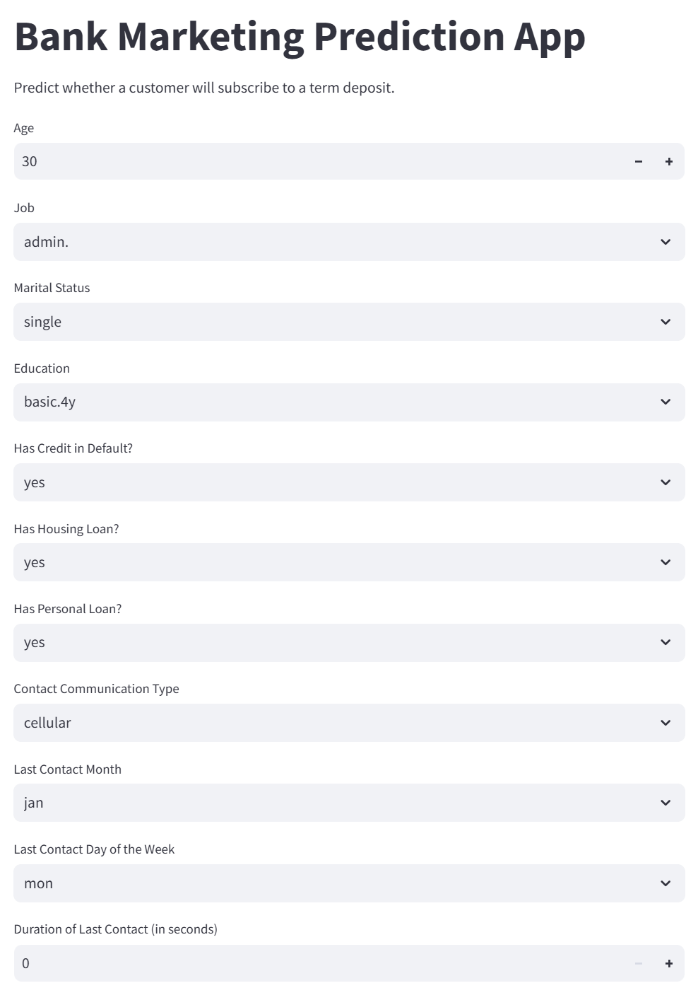
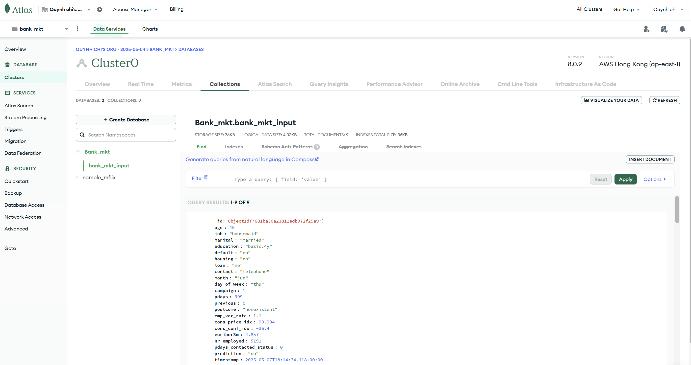

# 📦 MLOps Project K64 – Bank Term Deposit Prediction

Welcome to the **MLOps Project K64** repository! This project implements a full MLOps pipeline to predict whether a bank client will subscribe to a term deposit, using the **Bank Marketing Dataset**.

---

## 📌 Project Overview

This project applies MLOps principles to the entire machine learning lifecycle, including:

- Data ingestion and preprocessing
- EDA (Exploratory Data Analysis)
- Model training, validation, and testing
- Model registry
- Streamlit interface for prediction
- MongoDB integration for test data storage

---

## ⚙️ Technologies Used

- **Python 3.8**
- **scikit-learn**
- **pandas**, **numpy**, **matplotlib**, **seaborn**
- **Wandb** – for model tracking and registry
- **Streamlit** – for interactive user input and inference
- **FastAPI** - for backend to make predictions using a trained model
- **MongoDB** – for storing new test input data
- **Render** - for deployment

---

## 📚 Dataset Information

This project uses the **Bank Marketing Dataset** with social and economic features, made publicly available for research purposes.

> **Citation Request**  
> If you use this dataset, please cite:  
> **[Moro et al., 2014]** S. Moro, P. Cortez, and P. Rita.  
> *A Data-Driven Approach to Predict the Success of Bank Telemarketing*.  
> Decision Support Systems. [DOI: 10.1016/j.dss.2014.03.001](http://dx.doi.org/10.1016/j.dss.2014.03.001)  
> - [PDF](http://dx.doi.org/10.1016/j.dss.2014.03.001)  
> - [BibTeX](http://www3.dsi.uminho.pt/pcortez/bib/2014-dss.txt)

### 🔍 Source

- Created by: Sérgio Moro, Paulo Cortez, and Paulo Rita (2014)  
- Original UCI Repository: [Bank Marketing Dataset](http://archive.ics.uci.edu/ml/datasets/Bank+Marketing)

### 📌 Dataset Variants

- `bank-additional-full.csv`: Full dataset (41,188 instances)
- `bank-additional.csv`: 10% subset (4,119 instances), suitable for computationally intensive models

### 🧠 Prediction Task

- **Goal**: Predict if a customer will subscribe to a term deposit (target: `y`, values: `yes` or `no`)

---

For full attribute definitions, see the paper:  
**[Moro et al., 2014]** *A Data-Driven Approach to Predict the Success of Bank Telemarketing*

## 📁 Folder Structure

1. api: This folder contains backend source code for handling APIs and data pipelines.
   - app.py
   - main.py
   - pipeline.py
   - query_live_api.py
   - test_main.py
2. bankmkt: This folder contains scripts and executable files for setting up and managing the banking market project environment, including activation and deactivation scripts, as well as Python and pip executables for managing dependencies.
3. notebook: Directory for experiments, exploratory data analysis, and model development artifacts.
   - notebooks
   - data
   - wandb
   - artifact
4. environment.yml: Conda environment configuration file listing required dependencies and versions to ensure consistent setup across environments.

## 📑 Model Card

The model was deployed to the web using the FastAPI package and API tests were created. The API tests will be embedded in a CI/CD framework using GitHub Actions. After we built our API locally and tested it, we deployed it to Render and tested it again live. Weights and Biases were used to manage and track all artifacts.  


The project notebooks are organized into the following 7 parts:

1. Data Search
2. Exploratory Data Analysis (EDA)
3. Data Preprocessing
4. Model Testing
5. Data Splitting (Training & Testing)
6. Model Training
7. Model Evaluation

---

## 🚀 How to Run the Project

1. **Clone the Repository**
   ```bash
   git clone https://github.com/Qchi1610/Mlops_Project_K64.git
   cd Mlops_Project_K64
2. **Create a Virtual Environment**
   ```bash
   conda env create -f environment.yml
3. Activate the Virtual Environment
   ```bash
     # For Linux/macOS
   source bankmkt/bin/activate

   # For Windows (Command Line)
   bankmkt\Scripts\activate

   # For Windows (PowerShell)
   bankmkt\Scripts\Activate.ps1

## Practice notebooks
To understand the procedures of design code on local, including important procedures like: fetching data, visualization, preprocessing, checking data, segregating data, training, and testing, you should run step-by-step all notebooks on the /notebook directory. Note that, you should select a right kernel is .venv to avoid libraries conflict by


You should register Weight and Bias to storage all artifacts, metrics, and models. You can register your account on wandb. After that, you should create a virtual environment file is notebooks/.env

## Model Development
The model was developed in a Jupyter Notebook (6_train.ipynb), and includes data cleaning, data visualisation, feature engineering, and model evaluation using 10-fold cross-validation.

Initially, simple models were trained separately. 10 different algorithms are evaluated: Logistic Regression, KNearest Neighbors, Decision Tree, Random Forest and 5 Boosting algorithms. Below are 10-fold cross-validated results for each of the evaluated models based on **ROC-AUC** and **recall**.


## Weight and Biases Model Registry
Weight and Biases is used to register model training runs. Artifacts, which includes models, plots and statistics, are stored in a Weight and Biases, while the server is run in a Render, local Docker container and accessible via the URL specified above.

After model training and cross-validation run, the two best-performing models were selected for further hyperparameter tuning. Evaluation metrics including **AUC-PR**, **ROC-AUC**, **recall**, **precision**, and **F1-score** were logged on the validation set.


For hyperparameter tuning, **W&B Sweeps** were used to automate the search process and track all experiment runs. Due to the inability to pass the `class_weight` parameter via sweep configuration, an additional tuning session was conducted locally using **Optuna**, implemented in `notebook/6_train.ipynb`.


After tuning, only the best-performing model (based on validation metrics) was selected. This model was re-trained with the best parameters and evaluated on the test set. The final model, along with its performance, was then registered to the W&B Model Registry.


---

## 🚀 Deployment Steps (on Render)

### 🧠 Backend (FastAPI)

1. Create a new **Web Service** on Render.
2. Link it to your GitHub repo.
3. Set the start command:

   ```bash
   uvicorn api.main:app --host 0.0.0.0 --port 8000

   ```
4. Make sure `Dockerfile` or `requirements.txt` is correctly set up.
5. Instance Type choose Free
5. Set environment variables like `MONGODB_URI`, `WANDB_API_KEY` in the Render dashboard.


### 🎯 Frontend (Streamlit)

1. Create another **Web Service** for Streamlit on [Streamlit Community Cloud](https://blog.streamlit.io/host-your-streamlit-app-for-free/).
2. In `streamlit_app.py`, use `requests.post(API_URL)` (`API_URL created by Render "....onrender.com/predict"`) to connect to the FastAPI backend.
3. Set the start command:

   ```bash
   streamlit run streamlit_app.py

   ```

---

## 📄 Example `.env` File

```bash
MONGODB_URI=mongodb+srv://<username>:<password>@cluster.mongodb.net/mydb
WANDB_API_KEY=your_secret_key
```

---

## ⚙️ How It Works

1. **User Interface (Streamlit):**

   - Users access the Streamlit web app.
   - They input data for prediction.
   
2. **Backend API (FastAPI):**

   - Streamlit sends the input data to a FastAPI endpoint (e.g., `/predict`) via a POST request.
   - FastAPI loads the model, processes the input, returns the prediction.
   - The data and prediction are saved to MongoDB.
   
3. **MongoDB Integration:**

   - FastAPI connects to MongoDB using a URI stored in `.env`.
   - It saves each prediction request with metadata (timestamp, input, prediction).
   
4. **Deployment (Render):**

   - The backend (FastAPI) is deployed as a web service on Render.
   - The frontend (Streamlit) is deployed separately as a web service.
   - Communication happens via the backend’s public URL.

---

<p align="left">
  <a href="https://mlopsprojectk64.streamlit.app" target="_blank">
    
  </a>
</p>
